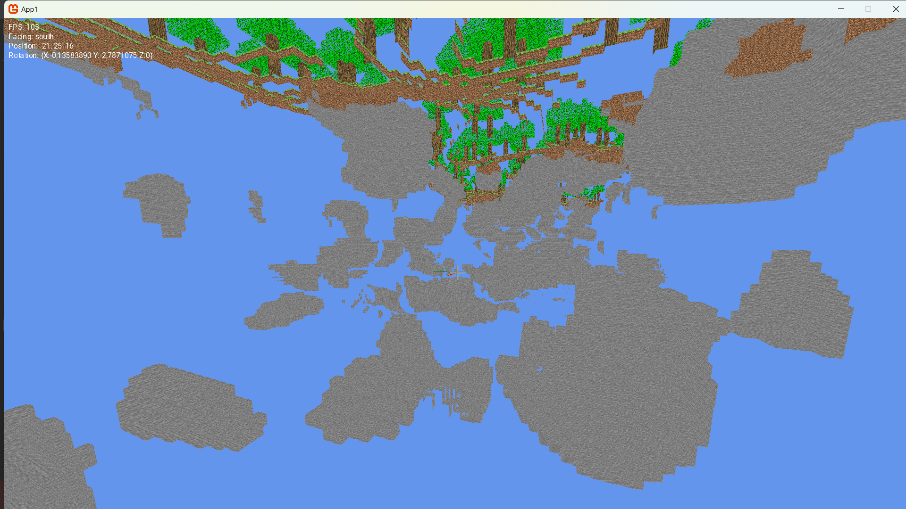
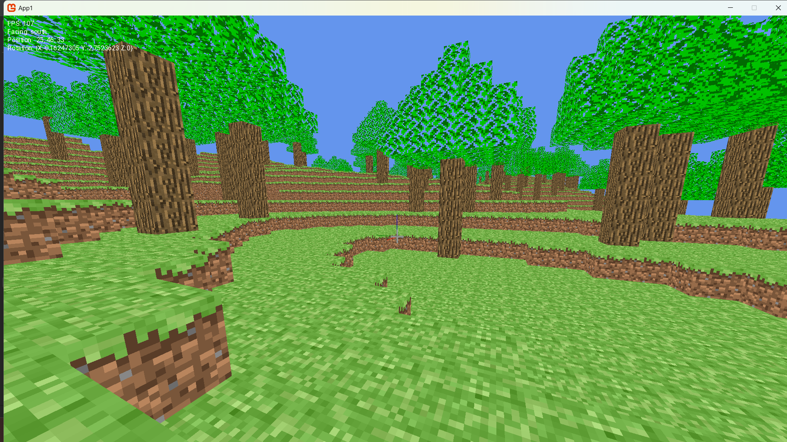

The goal of this project is to create a copy of minecraft playable in multiplayer
Focusing on making a modular engine and optimizing the rendering of the world

## Advancement of the project (28/01/2025)

- [x] Create a basic engine
- [x] Create a basic world generation
- [x] Face Culling
- [x] Atlas Texturing

// Some Face Culling

// Exemple of generation

## New Step (05/02/2025)

I have done a new architecture of the engine, where i load and render chunck separatly, so now i can have a sort of live vhcunk generation and render distance.
But, it is not yet optimized, i have to work on it.

- [] Move Chunk Generation & Mesh Updates to a Background Thread
- [] Use a Chunk Load Queue
- [] Mesh Streaming & Lazy Chunk Updates (Instead of regenerating the entire chunk mesh when a block changes, use partial updates. And actually i have no idea on how to modify a vertexbuffer in live)
- [] Use Mesh LOD (Level of Detail) for Distant Chunks (idk what i could render in distant horizon)
- [x] Batch Rendering (I have done a basic batch rendering, but i have to optimize it)

## Next

- [] survival mode
- [] crafting
- [] multiplayer